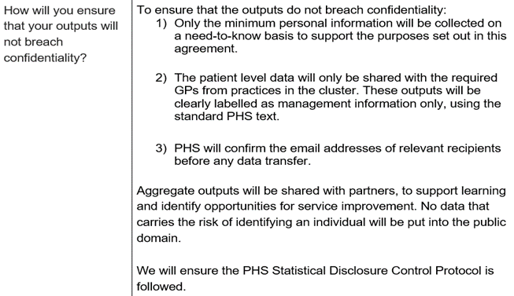

# Data Release and Linkage Forms

## When is a DRL required?

A DRL form is required for one/both of the following scenarios: 

- Release of patient level data from PHS dataset(s) 

- Data linkage, involving at least one PHS dataset

_If in doubt about whether a DRL form is required, please get in touch with the LIST IG Group who can advise._

## What is the process for a DRL form being approved?

LIST staff should take the following steps for a DRL form to be approved: 

**Step 1: Complete the sections of the form that LIST can complete**

- Download a copy of the DRL Form from the [Data Protection Handbook on the Spark](https://spark.publichealthscotland.org/corporate-guidance/information-governance/data-protection/data-protection-handbook/data-release-and-linkage-form/) to ensure you have the most recent template There is a copy of the DRL Form also available on the LIST IG SharePoint page (please ensure you make edits to your own copy and not the template on SharePoint) 

- LIST should complete all section of the form apart from sections 2 and 3. Section 6 will involve working with the local customer to agree the details 

- LIST can add the details they know for section 2 and 3 e.g. names, job titles, but these sections will be for the local contacts to complete [(see here for how to complete these sections)](#drlcompletion).

**Step 2: Send to LIST IG Group for review**

- Send form to a member of the LIST IG Group and ask for it to be reviewed 

- LIST IG Group will get back to you and advise of any required changes to the form ahead of obtaining local signatures  

    - Note: LIST IG Group are not providing an approval – we are carrying out a review and recommending changes based on our experience. Approval for the work to go ahead is provided from the PHS Data Protection Team 

**Step 3: Obtain local signatures**

- Make any required updates to the form as advised and then email the form to the applicant to complete section 2 

- Once the updated form has been returned, email the form to the local data controller representative(s) to complete section 3 

- Local data controller(s) will then return the form to LIST, form is now complete and ready to be submitted for approval 

**Step 4: Send the form to the Data Protection Team for approval**

- Email the completed form to Data Protection team mailbox **phs.dataprotection@phs.scot**

- Include LIST in the subject heading 

- Mention in the email that the LIST IG Group has reviewed the form 

**Step 5: Data Protection Team response**

- The Data Protection team may suggest changes to the form, update if required and then re-visit any of the steps above if advised to (e.g. depending on the nature of the changes suggested, it may require updated local signatures) 

- Re-submit to DP team if required 

**Step 6: Form Approved**

- The Data Protection team will email that they have approved the DRL form 

- Save email of approval 

- _Now that the PHS Data Protection Team have approved the form, the work can be carried out_

## How do I complete a DRL form? {#drlcompletion}

**Section 1 – What is this application for?**

In this section, you state whether the data request is for Local or National population data. 

- Local population data is for a single board/partnership/LA area or single independent contractor (e.g. GP). **LIST projects will use this option**.

- If the data required is for multiple areas, the request is for National population data (LIST will almost always be using Local population data) 

**Section 2 – Applicant/user details**

This section should be completed by the main customer for the data request. This person should: 

- Be one of our partner organisation customers:  

    - NHS Board employee 

    - Local Authority employee 

    - Cluster Quality Lead (CQL) 

    - GP Practice Staff (not a CQL) 

- Have a job title which gives them the geographic area of responsibility over the data requested – for example, a Service Manager within an HSCP requesting data for their own HSCP, or a GP Practice Manager requesting data for their own GP practice. 

- Have completed appropriate Information Governance training as detailed on the form, or alternatively have provided their registration number with a professional regulatory body (NMC/GMC/GDC/HCPC) when employed by the NHS. 

**Section 3 – Local data controller representative**

This section should be completed if applying for access to Local data (most common option within LIST). The Local Data Controller Representative is the person/s with the **authority to approve the Applicant** in terms of their professional status, integrity of their application for the data requested and the validity of the purposes stated on the form. This would be completed by: 

- For NHS Boards requesting data on their own treated/residing patients – the Caldicott Guardian, Medical Director, Clinical Director or Independent Contractor Principal must sign the DRL in this section 

- For HSCPs requesting data on their own population, BOTH the Caldicott Guardian for the Board and the Senior Responsible Officer for the partnership must sign the DRL in this section 

- For release of SOURCE data, BOTH the Caldicott Guardian for the Board and the Senior Responsible Officer for the partnership must sign the DRL in this section. This is because the HSCP and the Board are both data controllers of the SOURCE dataset, so permission needs to be given by both parties to access to the data 

- For release of data originating from Secondary Care to GPs regarding their own registered patients BOTH the Caldicott Guardian for the Board and a principal within the practice must sign the DRL in this section 

- See Section 3 of the form for further information on different scenarios 

**Section 4 – Data custodian**

This section should be completed if applying for access to National data, however in LIST it is unlikely that we would applying for this, so you can leave this section blank or enter N/A and complete Section 3 instead. 
 
**Section 5 – Research**

You should indicate here whether the request is for a research study or not. LIST projects should answer **No** here. 
 
**Section 6 – Nature and use of data requested, including a list of variables required**

In this section you should detail the exact nature of the data requested and what you plan to do with it.  

- 6a – detail the background, aim and method. For method, clearly state the work that LIST will be doing, which dataset(s) will be used and the output that will be provided to the customer 

- 6b – if the customer plans to publish the data, or if they could publish the data then state this here. Mention the PHS SDC protocol being followed / sharing the output as management information as appropriate 

- 6c – Provide the full list of variables from each dataset required, the time period and applicable geography. It is important for this to be comprehensive, but also considering the need for data minimisation only include the minimum number of variables necessary (or you think might be necessary when it’s for data linkage) for the scope of the project. If it is easier to do so, you can provide the list of variables in an attachment alongside the form 

**Section 7 – Team or service involved in accessing the data**

In this section you should list: 

- The LIST team involved in the piece of work (e.g. LIST Grampian) 

- All additional teams who will have access to the output e.g. HSCP contacts, staff from GP practice(s) etc 

**Section 8 - List of data marts/datasets/databases to be accessed and their corresponding designated information asset owner**

For LIST projects, the applicant will be a local customer and therefore the answer to question 8a will be **No**. 
 
**Section 9 - Measures in place to transfer, protect and use the data securely and confidentially**

See the below examples for suggested text to use – tweak as required for your own project and area. 

_Data Linkage Example_

```{r, echo=FALSE, out.width="100%"}
knitr::include_graphics("imgs/drl-linkage-1.png")
```

```{r, echo=FALSE, out.width="100%"}
knitr::include_graphics("imgs/drl-linkage-2.png")
```

_Releasing Patient-Level Data Example_

```{r, echo=FALSE, out.width="100%"}
knitr::include_graphics("imgs/drl-patientlevel-1.png")
```

```{r, echo=FALSE, out.width="100%"}

```

```{r, echo=FALSE, out.width="100%"}
knitr::include_graphics("imgs/drl-patientlevel-3.png")
```

**Section 10 - Intended duration of use of data**

In this section detail the expected end date for the work, how long the data will be kept for and how it will be destroyed. 

- For data linkage – complete from a LIST perspective: how long will the pre-linked patient level datasets be kept 

- For releasing patient level data – complete from a customer perspective: detail how long the customer will keep the data LIST provide 

