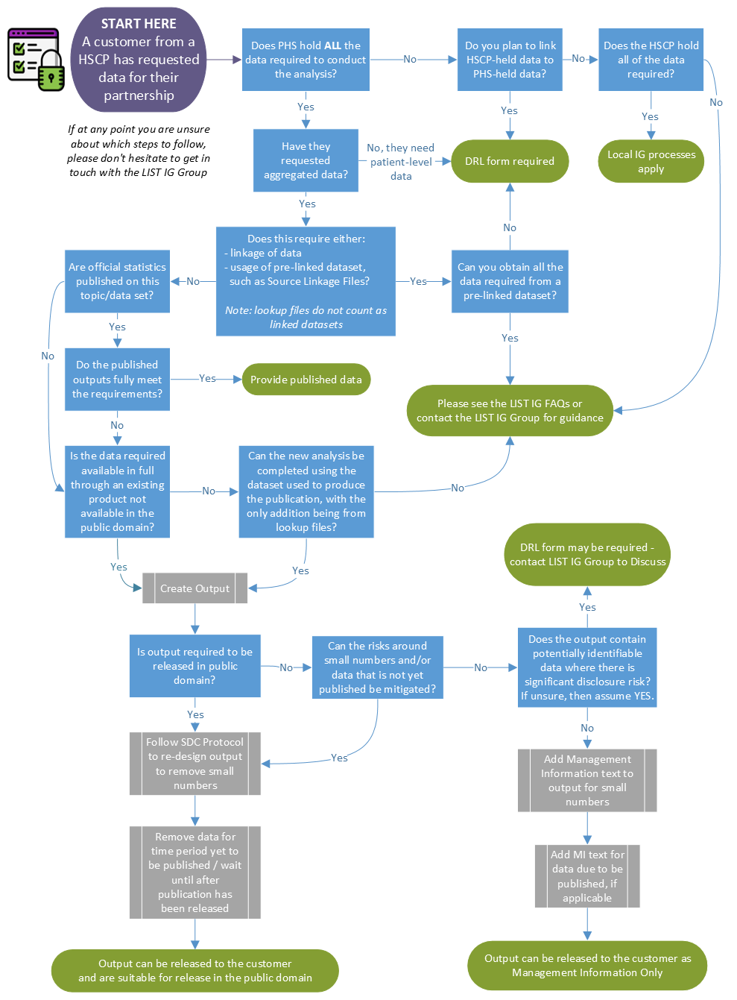

# Data for HSCPs

## Flowchart

In order to help you determine the right course of action when it comes to HSCP customers requesting data **from their own partnership**, we have created this flowchart.

```{r, echo=FALSE, out.width="100%"}

```

## Local data

When handling data which is locally-held and owned, it is best practice to store that data on local servers rather than PHS servers, unless you have a prior agreement in place with the HSCP to hold the data on PHS servers.

LIST can work with local NHS Board / Local Authority data in the following ways: 

- Accessing local data directly via local systems 

- Receiving local data from our local customers 

- Supporting new data collections 

**LIST Staff must follow the below local IG procedures**

_Accessing local data directly via local systems_

- Follow local IT processes re gaining access to data / systems / files & folders 

- Follow local procedures re storing and sharing data – liaise with local IG / Data Protection team as required 

- Follow local SDC protocols where appropriate for disseminating outputs 

_Receiving local data directly from Local Authorities_

- Obtain written confirmation that local IG processes have been followed. This can be done using either the email text or template below. 

- Follow local SDC protocols where appropriate for disseminating outputs 

_Receiving local data directly from NHS Boards_

- The intra-NHS Scotland Information Sharing Accord is an overall data sharing agreement for NHS Boards in Scotland 

- In addition to this, for NHS Boards to provide patient level data to PHS / LIST, a local data release form may need to be completed. Liaise with local Data Protection / IG team to find out what the local process is, as this process will vary by NHS Board. 

- Follow local SDC protocols where appropriate for disseminating output 

_Supporting new data collections_

- LIST can support the design of local data collections. This can then be passed to the local organisation for them to collect the data 

- Follow local IG advice re the tools that can / cannot be used - liaise with local IG / Data Protection team as required 

- For this data to be shared with LIST, follow the advice above for receiving local data from local authorities / NHS Boards as appropriate 

- Follow local SDC protocols where appropriate for disseminating outputs 

**If LIST are collecting the data on behalf of the local organisation, then please contact the LIST IG Group and/or the PHS Data Protection Team.**

## Local IG Documentation 

_LIST staff are not responsible for completing local IG documentation such as DPIAs or data sharing agreements._

**Obtaining Confirmation Local Authority IG processes have been followed**

LIST require written confirmation that local authority IG processes have been followed to obtain and work with local authority data. The following standard text can be sent to local authority contacts for this purpose if there is no other document requested or agreement in place by the local authority: 

    _"Can you please confirm that the local <insert organisation> Information Governance processes have been followed to authorise the transfer of <insert topic> data from <insert organisation>to the Local Intelligence Support Team (LIST) within Public Health Scotland._

    _It is the responsibility of each organisation to ensure compliance with local IG procedures. If you are unsure what the local processes are, then please contact your local IG / Data Protection team as required for guidance._

    _Once LIST receive email confirmation that local IG processes has been adhered to, then this will be considered as the necessary IG approval for LIST to receive and work with the local data for the agreed work on <insert project title / details as required>.”_

Alternatively, the following template can be used: 

    Project Name 

    Project Aim / Purpose 

    Summary of data to be shared and with whom 

    Customer / Project Lead 

    LIST main contact 

    What local IG form / process has been approved / who authorised the data sharing with LIST? 

    Date of agreement to share data 

    Duration of agreed data sharing / data retention period 

    Data Transfer Method

    Additional Information

    Once confirmation has been received, LIST staff should store this within project documentation. 