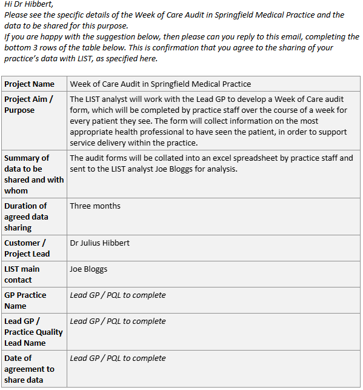

# Data for GPs

## E-Mail Template

In order to facilitate a piece of work with a GP practice using practice-held data, you can use our Email Template to outline the nature of the piece of work and gain agreement directly from the Lead GP or Practice Quality Lead. The agreement gives full transparency regarding the data the GP practice will provide and how LIST will use that data, with the GP practice then authorising the piece of work. 

- This email agreement will only cover the piece of work covered in the email and you would need to complete a new template for every piece of work undertaken with a practice. 

- If the piece of work covers multiple practices, you can send a separate email template to each practice to complete individually. 

- **Remember - if the project requires the linkage of PHS-held data to practice-held data, then you would require a DRL form to be signed off. Where a DRL is not required, you could use this Email Template instead.**

You can find our [Email Template here](https://scottish.sharepoint.com/:w:/r/sites/PHS-LIST/_layouts/15/Doc.aspx?sourcedoc=%7BA10F07C3-CFFC-4A82-9CD7-A2D6DBA1D6DB%7D&file=LIST%20IG%20-%20GP%20practice%20data%20sharing%20email%20template.docx&action=default&mobileredirect=true).

Here’s an example of a template which has been filled out. 

```{r, echo=FALSE, out.width="100%"}

```

## Working in GP Practices

On the occasion where a LIST staff member is asked to work within a GP practice, here are some advice and considerations:

- Contact LIST IG Group to discuss in the first instance. 

- A LIST Service Manager needs to agree to the LIST member of staff working in a GP Practice, they need to be aware of the proposed service and understand the heightened risks. 

- PHS staff must have completed the mandatory IG training & the MRC course within the last 2 years as detailed in the Data Protection Handbook 

- The practice provides agreement that they want LIST staff to work in their practice 

- The practice will normally ask the person to sign some kind of confidentiality statement if you are accessing their systems directly 

- PHS staff must follow all relevant local policies when entering the practice 

- PHS staff must be fully aware of the higher risks when accessing GP systems directly and the rules around accessing patient data.  Any misuse of this access could be a breach of contract and a breach of Data Protection law. 

- Staff must ensure that they are handling the data appropriately including any secure transfers. 

