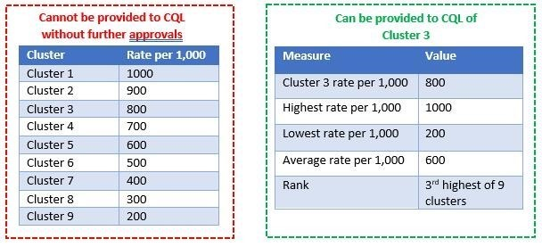
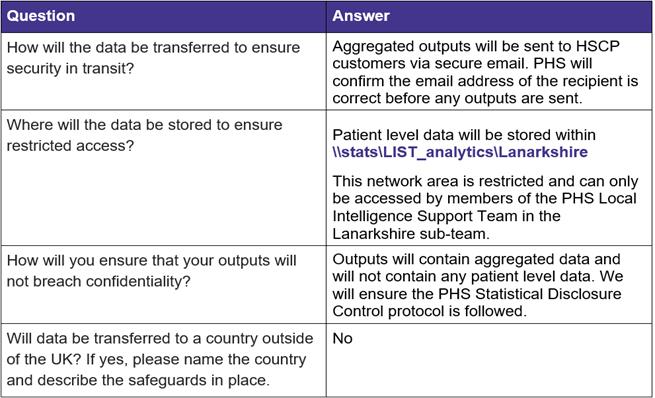
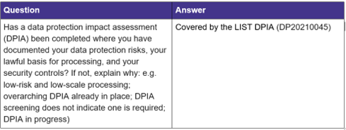
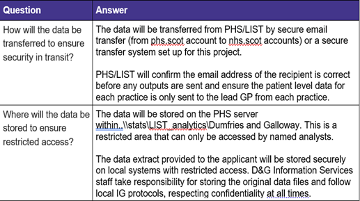
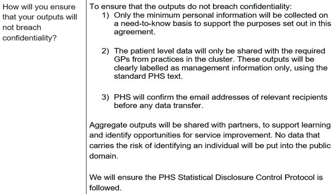
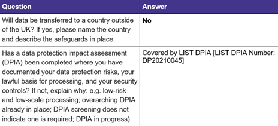
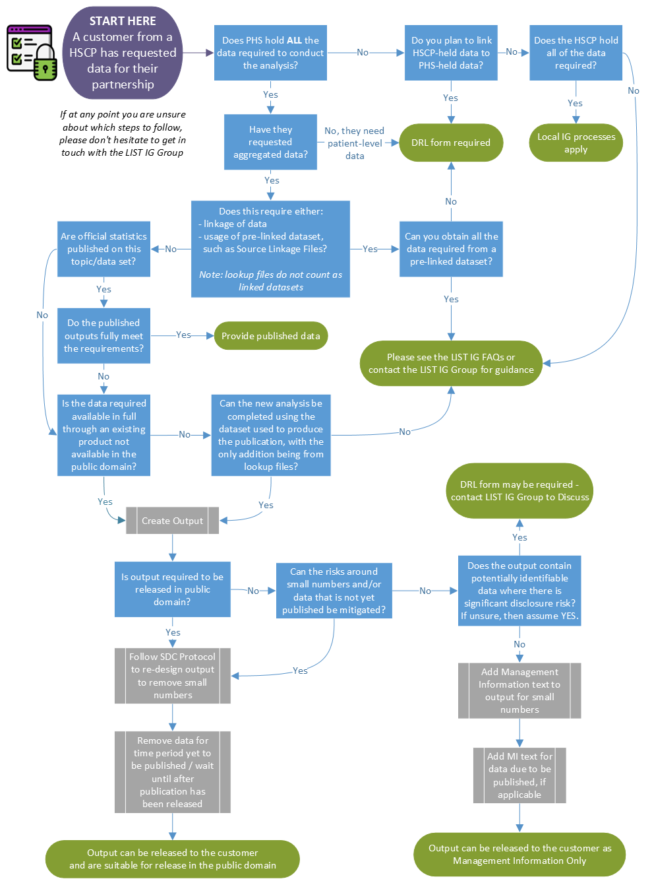
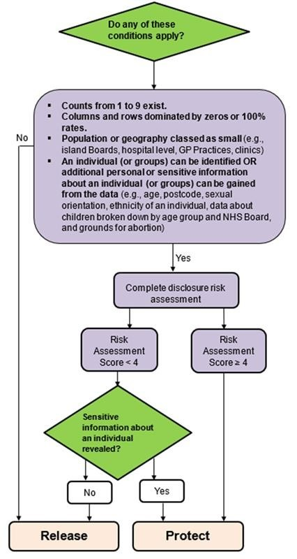

--- 
title: "LIST IG Handbook"
author: "The LIST Information Governance Cross-Team Group"
date: "`r Sys.Date()`"
site: "bookdown::bookdown_site"
output:
  bookdown::gitbook: default
documentclass: book
bibliography: ["book.bib", "packages.bib"]
biblio-style: apalike
link-citations: yes
---

# About

## This Handbook

This handbook was created by the LIST IG Cross-Team Group to support the wider LIST team around Information Governance. 

It is intended to be used as an initial training document [**to sit alongside the mandatory PHS Information Governance Training**](#training), and also as a helpful reference guide for LIST team members for any queries they may have around IG prior to getting in touch with us. 

However, _we would still encourage LIST team members to reach out to Group members with any questions that have not been answered here_.

## The LIST IG Cross-Team Group

The LIST IG Group are a cross-team group of LIST analysts who help support the wider team with any queries relating to Information Governance. 

The group meets regularly to discuss requests and queries, provide advice and support to fellow analysts and act as a go-between for LIST and PHS Data Protection.  

To contact the LIST IG Group with a query, you can either: 

1. Make a post in the [LIST IG teams channel](https://teams.microsoft.com/l/channel/19%3A9a435ecaaa6c4ca8b6a8313223116114%40thread.tacv2/Information%20Governance?groupId=3e609872-2e51-443b-a14c-e1216a3636d0&tenantId=10efe0bd-a030-4bca-809c-b5e6745e499a), or

1. Get in touch with individual members of the IG Group directly. You can find the list of current Group members in the sidebar of the LIST IG teams channel.

_If you're interested in joining the Group, or learning more about what that would entail, we would encourage you to get in touch with us. New members are always welcome!_

## Mandatory PHS Training {#training}

### Training Log

You can view your IG training compliance with the [LIST IG Training Log](https://scottish.sharepoint.com/:x:/r/sites/PHS-LIST/_layouts/15/Doc.aspx?sourcedoc=%7BF39C55E2-B0CB-45AC-86DD-2554D4816407%7D&file=LIST%20IG%20Training.xlsx&action=default&mobileredirect=true). **Once you have completed the relevant courses, please update this log with your dates of completion**. 

### Training Courses

The following training courses are mandatory and **must have been completed within the last 2 years**:  

1. NSS Information Governance in Action (PHS) - Turas Module 

1. [MRC: Research, GDPR and Confidentiality](https://byglearning.co.uk/mrcrsc-lms/course/index.php?categoryid=1)

The LIST IG team will routinely update the training that LIST staff have completed and will remind staff to ensure this is up-to-date. 

Further details can be found on [The Spark](http://spark.publichealthscotland.org/corporate-guidance/information-governance/data-protection/training-and-guidance/) 


<!--chapter:end:index.Rmd-->

# LIST IG Approvals Framework 

## Before Starting a Project

Before starting any project, there are a number of questions we should ask ourselves. We can then consult the LIST IG Approvals Framework to determine the way forward.

1. Who is my primary customer/contact? 

    - Determining your primary customer or contact for your project will be done during your initial meeting with the customer e.g. GP cluster or practice quality lead; HSCP service manager. 


1. Why are they asking for this data/information? 

    - Define clear aim(s) and objective(s) of the project in collaboration with your customer. 


1. Where is the data coming from?  

    - Map desired outcomes and variables to available data sources (local and/or national). 


1. Who owns that data?  

    - Identify data owner(s) and whether you need to gain permission to access that data. 


1. How do I access the data required? 

    - National data: Public Health Scotland 
    - GP data: Cluster or Practice Quality Lead  
    - Local data: Please discuss this with your local contacts 
    - Other: Third sector or partner organisations 


1. Am I using the minimum amount of variables/information required to do this project? 

    - Review variables / information required by your customer. 
    - _Data Minimisation is a key principle of Data Protection Law, meaning personal data should only be used when necessary_


1. Do I require patient-identifiable data? 

    - If you do require patient-identifiable data for your analysis, the best practice is to produce aggregate data outputs for the customer and use this to focus discussion on further details. 


1. Who is getting access to the data once I am finished with my analysis? 

    - Identify who will have access to the data and what level of information / data is therefore appropriate to present in your outputs e.g. aggregated vs. person identifiable data.  
    - Ask yourself “Do they have a genuine need to see all of the data I intend to give them?” 


1. Is there a way to provide this data that would not require disclosure of personally identifiable information? 

    - Consider ways in which you could present the data to your customer e.g. by aggregating the data by cluster, locality or GP practice. 

## About The Framework

The LIST IG Approvals Framework was implemented in January 2024 in order to outline who LISTs main customers are and the level of data we can provide to them. This depends on: 

1. Who the customer is 

    - _NHS Board customer_

    - _Local Authority customer_

    - _Cluster Quality Lead (CQL)_

    - _GP Practice Staff (who are not CQLs)_

1. The level of data required  

    - _Level 0: Published_

    - _Level 1: Aggregated Non Confidential / Publishable_

    - _Level 2: Potentially Disclosive / Management Information_

    - _Level 3: Patient Level_

    - _Non-PHS, Local data sources_

1. Whether the data required falls into the customers own geographic area of responsibility 

The framework is intended to be a useful tool for analysts to determine appropriate outputs for our customers. It can be found on the [LIST SharePoint Page](https://scottish.sharepoint.com/:x:/r/sites/PHS-LIST/_layouts/15/Doc.aspx?sourcedoc=%7B4675F488-0BED-48E2-967F-4D006D7BA596%7D&file=LIST%20IG%20Approvals%20Framework.xlsx&action=default&mobileredirect=true)

## Our Customers

LIST support two main workstreams: Health & Social Care Integration and Primary Care. Under the LIST IG Framework, there are four categories of customers LIST can send PHS data directly to: 

- NHS staff 

- Local Authority staff – (within a Health and Social Care Partnership) 

- Cluster Quality Leads (CQLs) 

- GP Practice Staff (who are not CQLs) 

_**What about other customer types?**_

- _ADP/CPP customers_

    LIST’s “direct customer” should be either a local authority or NHS employee who is a member of the ADP / CPP. LIST are not permitted to share data direct with ADP/CPP members from organisations outwith of NHS Board / Local Authority Staff. These organisations are trusted partner organisations of PHS where we already have an approved mechanism for sharing data with, other organisations included in the ADP/CPPs may not have such mechanisms in place. 

- _Universities_

    LIST do not support universities directly. LIST’s only interaction with university contacts should be via one of the 4 main customer types. For example, a HSCP may have commissioned a university to carry out analysis on their behalf. LIST only provide requested data direct to one of the 4 main customer types, never direct to the university contact. It is then for LIST’s customer to then share this data, ensuring they follow both PHS and local IG protocols as required. 

- _Third Sector_

    LIST do not support third sector organisations directly. LIST support third sector organisations on behalf of the HSCP. LIST would provide data direct to HSCP contact(s), then the HSCP contact would be responsible for sharing this data with the third sector, ensuring they follow both PHS and local IG protocols as required. 

_**What about data which isn’t held by PHS?**_

When we are requested to work with customers using their own local data sources, we must adhere to the local IG processes they have in place. 

## Comparator Data

It is common for customers to request their own data in the context of comparator data from other areas, to be able to compare their performance relative to others. Below are the key considerations for LIST to determine the data they can / can’t provide without further approvals in place. 

_**Who is the customer and what information does their role entitle them to?**_

Refer to the LIST IG framework for details on the data that different customer types are entitled to with/ without approvals. 

LIST can provide customers with data for their own geographic area of responsibility. We should not provide any data to a customer that means they can  gain intelligence about other areas or organisations that are outwith their responsibility, unless we: 

- Obtain senior approval from the area

- Use data available in the public domain – no approvals are required. 

_**What data can LIST provide if no further approvals are obtained**_

LIST can provide data for the customer’s _own geographic area of remit_. 

LIST cannot show/name other areas in the output, this includes LIST not being permitted to show the data with anonymised names. As these areas are outwith the customers area of remit, the customer is not entitled to this data without approvals in place. 

LIST can provide some limited comparator data to allow the customer to see how their area compares to others. LIST can provide: 

- Highest count/rate for the area 

- Lowest count/rate for the area 

- Average count/rate  

- The relative position/rank of the customer’s area compared to others. 


_Example 1: GP Cluster requests data to compare their own cluster against other clusters in the NHS Board or HSCP_

```{r, echo=FALSE, out.width="100%"}

```

Note: LIST must ensure that there are a sufficient number of comparators that no intelligence can be gained about others. 

_Example 2: NHS Board containing 2 HSCPs: HSCP A and HSCP B._

A local authority customer from HSCP A requests comparative data for their HSCP’s relative position with their NHS Board. It is not possible to provide the maximum/minimum/average/ranking data as there are only 2 HSCPs in the NHS Board. 

Providing this information would be providing data for HSCP B. The local authority customer is not entitled to this data, approvals are required from HSCP B. 

## Unpublished Data

Sometimes our customers may ask for the release of unpublished data for all HSCPs / NHS Boards in Scotland, and not just their own. The default approach will be for LIST to _provide the HSCP / HB with data for their own area only_. 

For any comparative data, **we will not provide any named HSCPs / NHS Boards outside their own area**. Instead, we can provide:

- The Scotland average

- Their own HSCP / HB’s position when ranked against the others 

    - e.g. their HSCP rate is ranked X / 31 (and also provide any required caveats re how feasible it is to compare areas in this way)

_What if the customer gets in touch to request that they need an output for all HSCPS / NHS Boards outside their own area?_

1. LIST will seek permission from the PHS national team that we can release this data.  LIST can only provide this output if we have expressed permission from the national team in PHS that this data can be provided.  

1. The output will be released as Management Information. Please ensure this is clearly noted on the output using the standard text. 

1. LIST need to inform the PHS national team of the following advice from the Statistical Governance team: 

"The Statistical Governance Team have advised that from the Information Request Protocol, _if this is the first time the information has been released, it should be sent for preview 48 hours before it is released to the customer as follows:_ 

  - _Analysis relating to a specific health board: email the PHS preview mailbox and request that the IR is sent to the Chief Executive and Communications Manager at that specific board_

  - _Analysis at national level: email the IR to your policy contact at the Scottish Government. If you are unsure of who to send it to, see the Contact Details section for a generic mailbox to use."_

## Obtaining Senior Approval

While our customers are entitled to receive data within their own geographic area of responsibility, for data outwith their geographic area of responsibility senior approval from the relevant area is required.

These are the areas of responsibilities of LIST’s different customer types:

  - NHS Board customer - responsibility within their own NHS Board

  - Local Authority customer - responsibility within their own LA / HSCP

  - Cluster Quality Lead (CQL) - responsibility for their own GP cluster 

  - GP Practice staff - responsibility for their own GP practice

The approvals required for the different customer types can be summarised below:

```{r, echo=FALSE, out.width="100%"}
knitr::include_graphics("imgs/seniorapproval-table.png")
```

Note this relates to levels 1 and 2 of the LIST IG Approvals Framework for data not available in the public domain. No approvals are required for data available in the public domain (level 0 on the LIST IG framework)

_How is the Senior Approval obtained?_

Obtain written approval from the senior person within the HSCP / NHS Board via email, detailing:

  - The data being shared

  - The purpose / the specific piece of work

  - Who the data is being shared with

**Examples**

_Example 1: HSCP_

  - LIST asked to provide new aggregated analysis (not available in public domain) of PHS held data, to allow the HSCPs to compare against each other

  - Senior Approval Obtained: Email agreement obtained by LIST from Service Managers in both HSCPs that they were happy for LIST to go ahead with this work comparing the HSCPs with each other

_Example 2: within same NHS Board_

  - One CQL from cluster A in NHS Board asks LIST to send them all GP Cluster Profiles for the clusters in the NHS Board

  - Senior Approval Obtained: LIST obtained email agreement from Head of Primary Care within the NHS Board that they authorise the sharing of GP cluster profiles within the NHS Board to be shared with all clusters

  - Alternatively senior approval could be obtained from all CQLs, however obtaining this approval from multiple CQLs would be time consuming, in instance it would be quicker/easier to obtain the approval from one senior contact within the NHS Board

_Example 3: different NHS Boards_

  - NHS Board A and NHS Board B would like to do a new piece collaborative piece of work comparing a range of indicators using aggregated PHS health data (new analysis, data not available in the public domain)

  - Senior Approval Obtained: LIST obtain approval from Caldicott Guardian from NHS Board A and from NHS Board B that they agree to carry out this work

  - LIST colleagues would obtain the senior approval from the NHS Board they cover

_Example 4: GP Clusters_

  - CQLs from Cluster A and Cluster B (both in same NHS Board) ask LIST to create new analysis comparing both clusters for the range of indicators in the GP Cluster Profiles

  - Senior Approval Obtained: LIST obtain email agreement from the CQL from both clusters A and B that they are happy for LIST to do this work

_Example 5: GP Practices_

  - PQL from Practice A asks LIST to create new analysis comparing with their neighbouring practice (Practice B) for the range of indicators in the GP Practice Profiles

  - Both practices within the same cluster / HSCP / NHS Board
  
  - CQL is not involved in this request

  - Senior Approval Obtained: LIST obtain email agreement from the PQL from both practices A and B that they are happy for LIST to do this work
  
## Collecting Data Locally

LIST are often asked to support surveys, particularly through the use of MS Forms, to collect data for further analysis. There is a Survey Guidance section of the PHS Data Protection Handbook which states that MS Forms is not approved for collecting personal data and should be avoided.  

At present, the approved software is LimeSurvey and there are details in the handbook on how to get a login, and when it might be necessary to get in touch with the Data Protection team. 

However, this guidance specifically relates to PHS work. In the instance where we are asked by local partners to assist with a survey using other software such as MS Forms for local data collection, and their local IG department is happy to approve its use for that particular project, then we can support this work. 

We should still remain vigilant regarding the collection of personal data, even in the instance where the local partners are happy to do so. Here are our top tips for surveys: 

  - Only collect the minimum amount of data required for the project 

  - Avoid, wherever possible, free text fields, to eliminate the possibility of collecting unnecessary personal data 

  - Prior to sending out the survey, check the settings to ensure the form won't automatically collect personal data in the background, such as the e-mail address of the responder 

  - Limit the number of people who have access to the dataset where the survey responses are collected 

<!--chapter:end:01-framework.Rmd-->

# Data Release and Linkage Forms

## When is a DRL required?

A DRL form is required for one/both of the following scenarios: 

- Release of patient level data from PHS dataset(s) 

- Data linkage, involving at least one PHS dataset

_If in doubt about whether a DRL form is required, please get in touch with the LIST IG Group who can advise._

## What is the process for a DRL form being approved?

LIST staff should take the following steps for a DRL form to be approved: 

**Step 1: Complete the sections of the form that LIST can complete**

- Download a copy of the DRL Form from the [Data Protection Handbook on the Spark](https://spark.publichealthscotland.org/corporate-guidance/information-governance/data-protection/data-protection-handbook/data-release-and-linkage-form/) to ensure you have the most recent template There is a copy of the DRL Form also available on the LIST IG SharePoint page (please ensure you make edits to your own copy and not the template on SharePoint) 

- LIST should complete all section of the form apart from sections 2 and 3. Section 6 will involve working with the local customer to agree the details 

- LIST can add the details they know for section 2 and 3 e.g. names, job titles, but these sections will be for the local contacts to complete [(see here for how to complete these sections)](#drlcompletion).

**Step 2: Send to LIST IG Group for review**

- Send form to a member of the LIST IG Group and ask for it to be reviewed 

- LIST IG Group will get back to you and advise of any required changes to the form ahead of obtaining local signatures  

    - Note: LIST IG Group are not providing an approval – we are carrying out a review and recommending changes based on our experience. Approval for the work to go ahead is provided from the PHS Data Protection Team 

**Step 3: Obtain local signatures**

- Make any required updates to the form as advised and then email the form to the applicant to complete section 2 

- Once the updated form has been returned, email the form to the local data controller representative(s) to complete section 3 

- Local data controller(s) will then return the form to LIST, form is now complete and ready to be submitted for approval 

**Step 4: Send the form to the Data Protection Team for approval**

- Email the completed form to Data Protection team mailbox **phs.dataprotection@phs.scot**

- Include LIST in the subject heading 

- Mention in the email that the LIST IG Group has reviewed the form 

**Step 5: Data Protection Team response**

- The Data Protection team may suggest changes to the form, update if required and then re-visit any of the steps above if advised to (e.g. depending on the nature of the changes suggested, it may require updated local signatures) 

- Re-submit to DP team if required 

**Step 6: Form Approved**

- The Data Protection team will email that they have approved the DRL form 

- Save email of approval 

- _Now that the PHS Data Protection Team have approved the form, the work can be carried out_

## How do I complete a DRL form? {#drlcompletion}

**Section 1 – What is this application for?**

In this section, you state whether the data request is for Local or National population data. 

- Local population data is for a single board/partnership/LA area or single independent contractor (e.g. GP). **LIST projects will use this option**.

- If the data required is for multiple areas, the request is for National population data (LIST will almost always be using Local population data) 

**Section 2 – Applicant/user details**

This section should be completed by the main customer for the data request. This person should: 

- Be one of our partner organisation customers:  

    - NHS Board employee 

    - Local Authority employee 

    - Cluster Quality Lead (CQL) 

    - GP Practice Staff (not a CQL) 

- Have a job title which gives them the geographic area of responsibility over the data requested – for example, a Service Manager within an HSCP requesting data for their own HSCP, or a GP Practice Manager requesting data for their own GP practice. 

- Have completed appropriate Information Governance training as detailed on the form, or alternatively have provided their registration number with a professional regulatory body (NMC/GMC/GDC/HCPC) when employed by the NHS. 

**Section 3 – Local data controller representative**

This section should be completed if applying for access to Local data (most common option within LIST). The Local Data Controller Representative is the person/s with the **authority to approve the Applicant** in terms of their professional status, integrity of their application for the data requested and the validity of the purposes stated on the form. This would be completed by: 

- For NHS Boards requesting data on their own treated/residing patients – the Caldicott Guardian, Medical Director, Clinical Director or Independent Contractor Principal must sign the DRL in this section 

- For HSCPs requesting data on their own population, BOTH the Caldicott Guardian for the Board and the Senior Responsible Officer for the partnership must sign the DRL in this section 

- For release of SOURCE data, BOTH the Caldicott Guardian for the Board and the Senior Responsible Officer for the partnership must sign the DRL in this section. This is because the HSCP and the Board are both data controllers of the SOURCE dataset, so permission needs to be given by both parties to access to the data 

- For release of data originating from Secondary Care to GPs regarding their own registered patients BOTH the Caldicott Guardian for the Board and a principal within the practice must sign the DRL in this section 

- See Section 3 of the form for further information on different scenarios 

**Section 4 – Data custodian**

This section should be completed if applying for access to National data, however in LIST it is unlikely that we would applying for this, so you can leave this section blank or enter N/A and complete Section 3 instead. 
 
**Section 5 – Research**

You should indicate here whether the request is for a research study or not. LIST projects should answer **No** here. 
 
**Section 6 – Nature and use of data requested, including a list of variables required**

In this section you should detail the exact nature of the data requested and what you plan to do with it.  

- 6a – detail the background, aim and method. For method, clearly state the work that LIST will be doing, which dataset(s) will be used and the output that will be provided to the customer 

- 6b – if the customer plans to publish the data, or if they could publish the data then state this here. Mention the PHS SDC protocol being followed / sharing the output as management information as appropriate 

- 6c – Provide the full list of variables from each dataset required, the time period and applicable geography. It is important for this to be comprehensive, but also considering the need for data minimisation only include the minimum number of variables necessary (or you think might be necessary when it’s for data linkage) for the scope of the project. If it is easier to do so, you can provide the list of variables in an attachment alongside the form 

**Section 7 – Team or service involved in accessing the data**

In this section you should list: 

- The LIST team involved in the piece of work (e.g. LIST Grampian) 

- All additional teams who will have access to the output e.g. HSCP contacts, staff from GP practice(s) etc 

**Section 8 - List of data marts/datasets/databases to be accessed and their corresponding designated information asset owner**

For LIST projects, the applicant will be a local customer and therefore the answer to question 8a will be **No**. 
 
**Section 9 - Measures in place to transfer, protect and use the data securely and confidentially**

See the below examples for suggested text to use – tweak as required for your own project and area. 

_Data Linkage Example_

```{r, echo=FALSE, out.width="100%"}

```

```{r, echo=FALSE, out.width="100%"}

```

_Releasing Patient-Level Data Example_

```{r, echo=FALSE, out.width="100%"}

```

```{r, echo=FALSE, out.width="100%"}

```

```{r, echo=FALSE, out.width="100%"}

```

**Section 10 - Intended duration of use of data**

In this section detail the expected end date for the work, how long the data will be kept for and how it will be destroyed. 

- For data linkage – complete from a LIST perspective: how long will the pre-linked patient level datasets be kept 

- For releasing patient level data – complete from a customer perspective: detail how long the customer will keep the data LIST provide 


<!--chapter:end:02-drl.Rmd-->

# Data for HSCPs

## Flowchart

In order to help you determine the right course of action when it comes to HSCP customers requesting data **from their own partnership**, we have created this flowchart.

```{r, echo=FALSE, out.width="100%"}

```

## Local data

When handling data which is locally-held and owned, it is best practice to store that data on local servers rather than PHS servers, unless you have a prior agreement in place with the HSCP to hold the data on PHS servers.

LIST can work with local NHS Board / Local Authority data in the following ways: 

- Accessing local data directly via local systems 

- Receiving local data from our local customers 

- Supporting new data collections 

**LIST Staff must follow the below local IG procedures**

_Accessing local data directly via local systems_

- Follow local IT processes re gaining access to data / systems / files & folders 

- Follow local procedures re storing and sharing data – liaise with local IG / Data Protection team as required 

- Follow local SDC protocols where appropriate for disseminating outputs 

_Receiving local data directly from Local Authorities_

- Obtain written confirmation that local IG processes have been followed. This can be done using either the email text or template below. 

- Follow local SDC protocols where appropriate for disseminating outputs 

_Receiving local data directly from NHS Boards_

- The intra-NHS Scotland Information Sharing Accord is an overall data sharing agreement for NHS Boards in Scotland 

- In addition to this, for NHS Boards to provide patient level data to PHS / LIST, a local data release form may need to be completed. Liaise with local Data Protection / IG team to find out what the local process is, as this process will vary by NHS Board. 

- Follow local SDC protocols where appropriate for disseminating output 

_Supporting new data collections_

- LIST can support the design of local data collections. This can then be passed to the local organisation for them to collect the data 

- Follow local IG advice re the tools that can / cannot be used - liaise with local IG / Data Protection team as required 

- For this data to be shared with LIST, follow the advice above for receiving local data from local authorities / NHS Boards as appropriate 

- Follow local SDC protocols where appropriate for disseminating outputs 

**If LIST are collecting the data on behalf of the local organisation, then please contact the LIST IG Group and/or the PHS Data Protection Team.**

## Local IG Documentation 

_LIST staff are not responsible for completing local IG documentation such as DPIAs or data sharing agreements._

**Obtaining Confirmation Local Authority IG processes have been followed**

LIST require written confirmation that local authority IG processes have been followed to obtain and work with local authority data. The following standard text can be sent to local authority contacts for this purpose if there is no other document requested or agreement in place by the local authority: 

    _"Can you please confirm that the local <insert organisation> Information Governance processes have been followed to authorise the transfer of <insert topic> data from <insert organisation>to the Local Intelligence Support Team (LIST) within Public Health Scotland._

    _It is the responsibility of each organisation to ensure compliance with local IG procedures. If you are unsure what the local processes are, then please contact your local IG / Data Protection team as required for guidance._

    _Once LIST receive email confirmation that local IG processes has been adhered to, then this will be considered as the necessary IG approval for LIST to receive and work with the local data for the agreed work on <insert project title / details as required>.”_

Alternatively, the following template can be used: 

    Project Name 

    Project Aim / Purpose 

    Summary of data to be shared and with whom 

    Customer / Project Lead 

    LIST main contact 

    What local IG form / process has been approved / who authorised the data sharing with LIST? 

    Date of agreement to share data 

    Duration of agreed data sharing / data retention period 

    Data Transfer Method

    Additional Information

    Once confirmation has been received, LIST staff should store this within project documentation. 

<!--chapter:end:03-dataforhscps.Rmd-->

# Data for GPs

## E-Mail Template

In order to facilitate a piece of work with a GP practice using practice-held data, you can use our Email Template to outline the nature of the piece of work and gain agreement directly from the Lead GP or Practice Quality Lead. The agreement gives full transparency regarding the data the GP practice will provide and how LIST will use that data, with the GP practice then authorising the piece of work. 

- This email agreement will only cover the piece of work covered in the email and you would need to complete a new template for every piece of work undertaken with a practice. 

- If the piece of work covers multiple practices, you can send a separate email template to each practice to complete individually. 

- **Remember - if the project requires the linkage of PHS-held data to practice-held data, then you would require a DRL form to be signed off. Where a DRL is not required, you could use this Email Template instead.**

You can find our [Email Template here](https://scottish.sharepoint.com/:w:/r/sites/PHS-LIST/_layouts/15/Doc.aspx?sourcedoc=%7BA10F07C3-CFFC-4A82-9CD7-A2D6DBA1D6DB%7D&file=LIST%20IG%20-%20GP%20practice%20data%20sharing%20email%20template.docx&action=default&mobileredirect=true).

Here’s an example of a template which has been filled out. 

```{r, echo=FALSE, out.width="100%"}
knitr::include_graphics("imgs/gp-emailtemplate-example.png")
```

## Working in GP Practices

On the occasion where a LIST staff member is asked to work within a GP practice, here are some advice and considerations:

- Contact LIST IG Group to discuss in the first instance. 

- A LIST Service Manager needs to agree to the LIST member of staff working in a GP Practice, they need to be aware of the proposed service and understand the heightened risks. 

- PHS staff must have completed the mandatory IG training & the MRC course within the last 2 years as detailed in the Data Protection Handbook 

- The practice provides agreement that they want LIST staff to work in their practice 

- The practice will normally ask the person to sign some kind of confidentiality statement if you are accessing their systems directly 

- PHS staff must follow all relevant local policies when entering the practice 

- PHS staff must be fully aware of the higher risks when accessing GP systems directly and the rules around accessing patient data.  Any misuse of this access could be a breach of contract and a breach of Data Protection law. 

- Staff must ensure that they are handling the data appropriately including any secure transfers. 


<!--chapter:end:04-dataforgps.Rmd-->

# Sharing Data

## Producing Outputs

The best practice is to produce **aggregate outputs** rather than patient-identifiable outputs. This will of course be driven by your customer’s requirements. 

1. Please always adhere to **[Statistical Disclosure Control](#sdc)** and conduct a Risk Assessment of the data you are releasing.

1. You must always comply with [National Statistics Code of Practice](https://gss.civilservice.gov.uk/wp-content/uploads/2018/03/Code-of-Practice-for-Statistics-4.pdf).

1. If you are releasing data to your customer which is not nationally published or available, **please indicate in your covering email that this is for management information only** (i.e. it is not be shared or published by the customer). Learn more about Management Information [here](#managementinformation)

1. If you are unsure about what you can and cannot release / publish, please seek advice from your line manager and/or other experienced analysts, or contact the Statistical Governance Team (phs.statsgov@phs.scot).

## Statistical Disclosure Control {#sdc}

Statistical disclosure control is a set of methods we apply, usually restricting or reducing the detail of data being released, in order to reduce the risk of personal identifiable information about data subjects. This is important to consider in our work within LIST, especially in the instance that some of our outputs may end up in the public domain. 

In the instance where you are releasing aggregated information about individuals, you should consider applying SDC in the instance where: 

- The output is to be released into the public domain 

- The output is not intended for the public domain, but risks around small numbers and/or data that is not yet published can be mitigated  

    - _If these risks cannot be mitigated then a DRL form may be required, or the output can be released as Management Information Only if there isn’t a significant disclosure risk_

The SDC Flowchart and risk assessment form available on The Spark is helpful to determine what courses of action you might take if you intend to apply SDC to your output.

```{r, echo=FALSE, out.width="100%"}

```

The full [SDC Protocol document](https://spark.publichealthscotland.org/corporate-guidance/statistical-governance/statistical-disclosure-control/overview-of-disclosure-control-protocol/) also contains some helpful of examples of how you might redesign your output to remove small numbers. 

## Management Information {#managementinformation}

Sometimes we might be providing our customers with data which is not suitable for publication, such as aggregated data with small numbers which can't be aggregated further due to the customers' requirements for the data. In such cases as these we would provide the output as Management Information Only. By marking the output as MI only we are reducing the risk of disclosure by the onward distribution of, or inadvertent release into the public domain of, the data provided. 

The MI text has been updated in the latest version of the Statistical Disclosure Protocol, available on The Spark, which you can see below.

- In addition to this, we recommend including a Management Information Only statement in the email in which you send the output to your customer. We also recommend reiterating verbally in any meetings with customers that the output is for Management Information purposes only. 

Label each table/chart as "Management Information only, not for onward distribution", or at the top of the output as a title. 

The standard text below should be added as a footnote to each table/chart: 

- **This information has been released for management information purposes only. The data have not been adjusted to protect against potential disclosure risks and may contain information which enables (perhaps with the aid of further knowledge of the topic) an individual patient or member of staff to be identified. Please ensure circulation is restricted and that patient confidentiality is not compromised. Please contact phs.statsgov@phs.scot if you have any queries around this or if there is any breach of the terms of the restricted management information.**

_You should highlight all Management Information text in red to draw attention to the statement._

When releasing unpublished data you might use a slightly different statement, such as the one below which is used in the MSG reports: 

- **Data Release Note: These reports are released for management purposes only and contain previously unpublished data. Please treat the material and any indication of the results as restricted until general release.**
- **Please note that some data in the tables below may be affected by data completeness issues, particularly in recent months. See the Completeness tab for further information.**

You can find information about MI within the Statistical disclosure control protocol document on [The Spark](https://spark.publichealthscotland.org/downloads/statistical-disclosure-control-protocol/).

**What do I do if I release data as Management Information to a local partner, but then they publish it?**

LIST have responsibility to ensure that when we release management information to a HSCP that it is clearly labelled with the management information text on the output itself and also the email used to disseminate the output. See the PHS Statistical Disclosure Protocol for more details on this guidance. 

HSCPs have a responsibility to treat this information appropriately and follow the PHS guidance on the use of management information. If this information is published then the onus is on the HSCP to ensure they follow local protocols re how they should treat this, and they should also inform LIST this has happened. 

There may be local reasons why a decision to publish was made, but it may also be that a mistake has occurred.  If staff are ever concerned they should raise this with their line manager in the first instance. 

## Sending Data Securely

Outside of PHS staff, the only individuals we can send confidential data to are those with either:

- NHS Scotland e-mail addresses (nhs.scot, nhs.scot.uk), or

- Local authority e-mail addresses (councilname.gov.uk)

_**LIST should not be sending confidential data to any other e-mail domains, e.g. university, third sector etc.**_

On the occasion where our customer has a university e-mail address in addition to one of our trusted, secure e-mail addresses (such as an NHS Scotland e-mail address), we must ensure we send data to their secure e-mail and not their university e-mail address.

### Sending by Secure File Transfer

The best, most secure way to send confidential data to our customers is via secure file transfer, using either:

- Globalscape, or

- SWAN

These are trusted tools which enable safe and secure transfer of data, as well as enabling data transfer of files which are too large for e-mail attachments. You can apply for access to an account and find out more details on Service Now.

### Sending by E-mail Transfer

There may be instances where it is more appropriate to send confidential data via e-mail, which is an acceptable way to transfer confidential data provided you follow these steps to ensure the transfer of this data is as safe and secure as possible:

1. Do not attach the data to the e-mail until you have completed all these steps to ensure that you do not accidentally send the data in an unsafe manner.

1. Ensure that you have the correct e-mail address, as there may be more than one person in the organisation with the same name. Ensure that you are not using group/circulation lists and that you are only e-mailing the named individuals on the DRL form who are entitled to access the data - the recipients should be referenced in section 7 of the DRLF, although the individuals may not be named so you should check with the applicant of the DRLF.

    If in doubt, send a test e-mail to the customer beforehand to ensure it is the correct recipient for the data, and only send the data onwards once you’ve received that confirmation.

    We also recommend you avoid the use of bcc.

1. Draft the e-mail to the customer, ensuring to include the following standard texts within the e-mail: 
 
    Management Information Text must be included in the email, as well as on the attached file containing the patient level data. Read more about Management Information text [here](#managementinformation)
 
    You should also include this text to instruct the customer to delete the email:

    **Please ensure that as soon as you have downloaded this attachment and saved it in a secure area, that you delete this e-mail from your inbox and your ‘deleted items’ folder to reduce the risk of data duplication.**

    This is because when we send data as an attachment within an e-mail, it is copied over and over again and multiple versions of the data are saved within various individuals’ outlook storage, as well as copies stored on secure areas. We recommend you discuss this with your customer beforehand and ensure that they understand the need to not retain data within their e-mail inbox for longer than necessary.

    We also recommend that LIST analysts also delete these e-mails from their own Outlook as soon as they are no longer required.

1. Implement at least one of the following options:

    - Add the text ‘[secure]’ to the start of the subject line of the e-mail, or

    - Encrypt the e-mail, which is available within the Options menu of the Outlook message window

    This adds a layer of encryption to the e-mail and an added layer of security to the data. We would recommend using the [secure] function, however, as we found that when we tested the Encryption method it can lead to an error message for council e-mail addresses. This is intended to be addressed in future updates to Outlook.

_**What about password protection?**_

Many in LIST opt to apply password protection to the data file, and sending the password within a separate e-mail, either within the e-mail text or as an attached ‘read me’ file. This is acceptable to do, however you should consider that if the individuals e-mail account is hacked it is only too easy for the hacker to obtain the password if it’s merely held in a secondary e-mail. Overall, double checking who you are sending the e-mail to and applying encryption to the e-mail, as well as encouraging our customers to delete the e-mails once they’ve obtained the data attachments, are more effective at reducing overall risk of sending confidential data via e-mail.

_**Should I send the data in two parts, with an anonymous link for the CHI number?**_

This is an option you may consider; however, it relies on the customer being able to successfully merge the documents properly, therefore it’s not something we would generally recommend. If you have followed the recommended steps to send the data securely this should not be necessary.

_**What other options do I have when sending confidential data via secure e-mail?**_

In addition to the recommend steps as detailed above, there are a few other options available within Outlook which you may not be aware of:

- You can restrict the e-mail to prevent recipients from forwarding the e-mail onwards.

- Add a delay to the e-mail to schedule it to send at a later time.

Both options are available in the options menu within Outlook.

_**What about when sending non-confidential data?**_

If the data is not confidential, then it is appropriate to send as an e-mail attachment without the above additional security steps, unless the file size is too large to send via e-mail, in which case you should consider using Globalscape/SWAN to enable file transfer.


<!--chapter:end:05-sharingdata.Rmd-->

